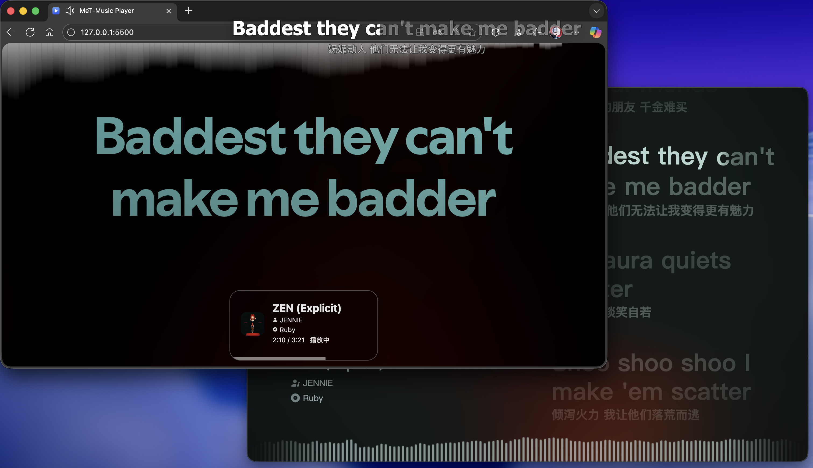

# MeT-Music Player

> 一个基于 React 的网页端播放器。配合 MeT-Music 实现远程收听功能。包含歌词显示、音乐频谱、歌曲信息、流体背景等功能。

## 图片预览



## 功能特性

* 通过 SessionID 与客户端同步播放进度，实现实时收听，实时歌词
* 下方显示歌曲信息，包括封面，歌曲名，歌手，专辑等
* 上方显示条形音乐频谱
* 背景封面图片流动
* 背景阴影单词筛选机制

## 本地开发

本项目使用 `pnpm` 作为包管理工具，并基于 `Vite` 构建。

### 1. 克隆仓库

```bash
git clone https://github.com/MeTerminator/MeT-Music_Player.git
cd MeT-Music_Player
```

### 2. 安装依赖

```bash
pnpm install
```

### 3. 启动开发服务器

```bash
pnpm dev
```

### 4. 生产构建

```bash
pnpm build
```


## 快速开始

1. **设置 SessionID**：首次使用或需要同步时，请先访问 `/settings.html` 页面。
2. **保存配置**：在设置页面输入你的 `SessionID` 并保存。
3. **开始同步**：返回主页或刷新页面，播放器将通过 WebSocket 自动连接并同步播放状态、歌词及歌曲信息。


## 技术栈

* **核心框架**: [React 19](https://react.dev/)
* **构建工具**: [Vite 7](https://vitejs.dev/) (极速的热更新与构建体验)
* **状态管理**: React **Context API** (轻量级全局状态共享)
* **实时通信**: **WebSocket** (实现与客户端的低延迟进度同步)
* **样式处理**: **原生 CSS** (纯粹的样式控制，无额外 DSL 负担)
* **图像处理**:
* `@lokesh.dhakar/quantize`: 用于提取封面主色调
* `sharp` / `ndarray-pixels`: 高性能图像像素处理


* **离线支持**: [Vite Plugin PWA](https://vite-pwa-org.netlify.app/) (支持作为网页应用安装)


## 功能特性详情

* **实时同步**: 基于 WebSocket 握手，通过 SessionID 精确匹配远程客户端的播放状态。
* **音乐视觉化**: 内置条形音乐频谱，带来沉浸式听歌体验。
* **动态视觉**:
* **流体背景**: 背景封面随音乐节奏或交互产生流动效果。
* **单词筛选**: 独特的背景阴影单词筛选机制，增强界面层次感。


* **PWA 支持**: 支持添加到桌面，像原生 App 一样启动。


## 如何贡献

1. **Fork** 本仓库。
2. **Create** 你的特性分支 (`git checkout -b feature/AmazingFeature`)。
3. **Commit** 你的修改 (`git commit -m 'Add some AmazingFeature'`)。
4. **Push** 到分支 (`git push origin feature/AmazingFeature`)。
5. **Open** 一个 Pull Request。


## 许可证

本项目采用 MIT License 开源许可证。
